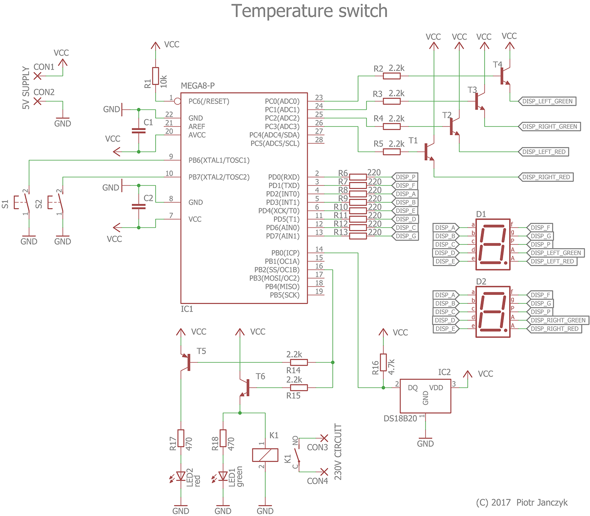

# Temperature switch
AVR-based temperature switch with adjustable temperature thresholds and 7-segment display suitable for steering 230V device.

## Software
Written in C, requires Atmel AVR GNU Toolchain (part of Atmel Studio) to compile.

## Hardware

